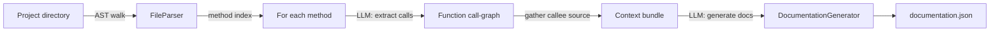

<p align="center">
  
</p>

<h1 align="center">PyDocGen</h1>

<p align="center">
  <b>Context-aware documentation generator for Python.</b><br/>
  Parses your codebase with the AST, resolves each method's call-graph, and uses an LLM to write docs that actually understand how your functions fit together.
</p>

<p align="center">
  
  
  
</p>

---

## Why PyDocGen

Most "AI docstring" tools feed a single function to an LLM in isolation, so the generated docs miss what the function actually *does* with its collaborators. PyDocGen is different: for every method it first **extracts the functions that method calls**, pulls in their source as **context**, and only then asks the model to document it. The result is documentation grounded in the real call-graph, not guesswork.

## How it works



1. **`FileParser`** walks the target directory and uses Python's `ast` module to build an index of every class method and its source.
2. **`DocumentationGenerator`** asks the LLM to extract the function calls inside a method (returned as structured JSON).
3. The source of those callees is assembled into a **context bundle**.
4. A second LLM call generates documentation for the method *with that context*, describing purpose, inputs, and outputs.
5. Results are written to **`documentation.json`**.

### Modules

| Module | Responsibility |
| --- | --- |
| `main.py` | Orchestrates the end-to-end run |
| `file_parser.py` | AST-based discovery and indexing of methods |
| `ast_parser.py` | Low-level AST extraction helpers |
| `documentation_generator.py` | Call-graph extraction + context-aware doc generation |
| `open_ai_client.py` | Singleton OpenAI client |
| `config.py` | API key, ignored folders, target directory |
| `helper.py` | JSON output utilities |

## Demo

PyDocGen run against its own source tree:


## Installation

```bash
git clone https://github.com/yogeshsherawat/py-doc-gen
cd py-doc-gen
pip install -r requirements.txt
```

## Usage

1. Set your values in `config.py`:

```python
OPENAI_API_KEY = "sk-..."          # your OpenAI key
IGNORE_FOLDERS = ["venv"]          # folders to skip
DIRECTORY_PATH = "/path/to/project" # codebase to document
```

2. Run it:

```bash
python main.py
```

3. Open the generated **`documentation.json`** alongside your code.

> Tip: prefer loading the key from an environment variable instead of committing it to `config.py`.

## Configuration

| Setting | Description |
| --- | --- |
| `OPENAI_API_KEY` | OpenAI API key used for both call-extraction and doc-generation |
| `IGNORE_FOLDERS` | Directory names to exclude (e.g. `venv`, `__pycache__`) |
| `DIRECTORY_PATH` | Root of the project you want documented |

## Roadmap

- [ ] Markdown / HTML output in addition to JSON
- [ ] Pluggable model backends (local LLMs via Ollama)
- [ ] Incremental runs (only re-document changed methods)
- [ ] CI mode that fails on undocumented public methods

## Tech

`Python` · `AST` · `OpenAI GPT` · `Prompt engineering` · `Static analysis`

## License

MIT — see [LICENSE](LICENSE).
